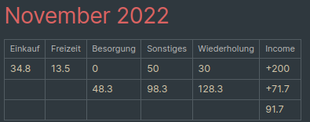

# croniev-bookkeeping
This PlugIn is very specific and tailored to my need.

**Work-In-Progress**: Shitty code that will be made more generic at some point in the future.

## Usage
In the file "_transactions" add all expenses.  
Months or other sub-groups can be made using headings.  
A transaction consists of 1 letter, an amount, and optionally a description. These three components are separated by spaces. Examples:  
```
# November 2022
g 20 starting
i 200 salary
e 34.7 aldi groceries
f 13.2 bar, kebap, and club
s 50
w 30 internet
b 0 toothbrush
```
The single letter represents the category ("bin"). At the moment these are set to be:  
`g`: starting money (geld)  
`i`: income  
`w`: repeating (wiederholung)  
`e`: groceries (einkaufen)  
`f`: free time  
`b`: purchases (besorgung)  
`s`: other (sonstiges)  

Executing the Croniev-Bookkeeping command will create a table for each (sub-)group under a heading and place it in the file "_ledger".  
This table will also show sums for `e+f+b`, `e+f+b+s`, `e+f+b+s+w`, `overall=i-(e+f+b+s+w)`, and `g+overall` (see example below).  


## Planned changes
- Being able to adjust the categories, the read and write files, and the table contents.  
- Also listing the single entries in the table, not just the sum.  
- Possibly chaning the input mode to make it more organized.
