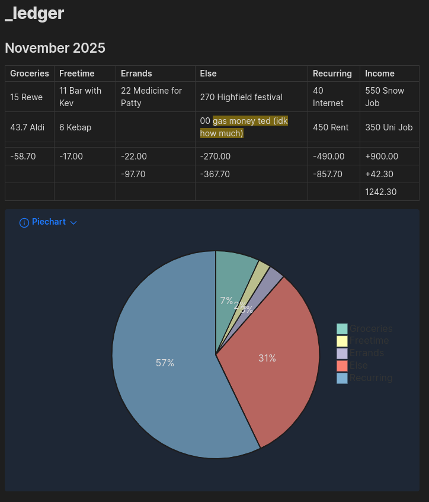

# croniev-bookkeeping
This is a plugin for low-level bookkeeping. For the best experience I make use of the [QuickAdd Plugin](https://github.com/chhoumann/quickadd/).  
Feel free to fork, you can ask or contact me any time.

### Settings Menu
__Transactions file__: _Existing file_ where entries are grouped under headings.  
__Ledger file__: _Existing file_ where compiled entries are presented after using command "__Update Ledger__".  

Example Transactions file:  
  

Example Ledger file:  
  

Example Settings:  
  

__Entry__: `[bucket] [amount] [description]`  
`[amount]`: any float  
`[description]`: any string  
`[bucket]`: one of the buckets defined in the settings page:  
  

You can choose to show less or more information in the compiled file:  
  

For the structure of the table:  
  
In each line define a bucket that should be displayed and define which buckets should be displayed summed together.  
The first symbol specifies whether a sign should be shown before the value (`+,-,0`).  

If at any place an undefined bucket is used the data will not be compiled but an error message will be printed into the ledger file instead.  

### Extensions
To easily add entries to the current month, I use a [QuickAdd Plugin](https://github.com/chhoumann/quickadd/) Choice that is bound to a Hotkey and looks like this:  

